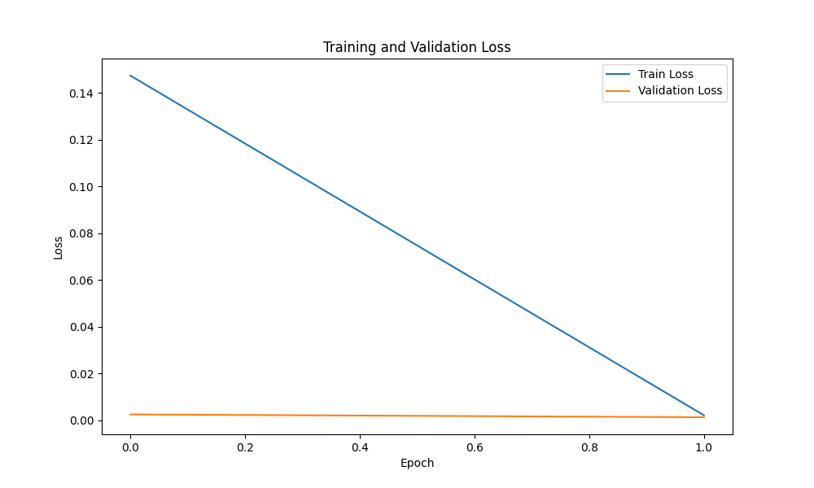

   
 
# Technical Report: Gaming Intent Detection

## Table of Contents

1. [Problem Definition](#1-problem-definition)
   - [1.1 Task Description](#11-task-description)
   - [1.2 Problem Formulation Considerations](#12-problem-formulation-considerations)
     - [Considerations](#considerations)
2. [Data Analysis](#2-data-analysis)
   - [2.1 Dataset Overview](#21-dataset-overview)
   - [2.2 Class Distribution](#22-class-distribution)
   - [2.3 Detailed Categories](#23-detailed-categories)
   - [2.4 Data Characteristics](#24-data-characteristics)
   - [2.5 Dataset Text Analysis](#25-dataset-text-analysis)
   - [Additional Analysis](#additional-analysis)
3. [Solution Approach](#3-solution-approach)
   - [3.1 Diagram Architecture](#31-diagram-architecture)
   - [3.2 Model Selection](#32-model-selection)
   - [3.3 Data Preprocessing](#33-data-preprocessing)
   - [3.4 Model Architecture](#34-model-architecture)
   - [3.5 Training Strategy](#35-training-strategy)
   - [3.6 Handling Class Imbalance](#36-handling-class-imbalance)
4. [Results and Analysis](#4-results-and-analysis)
   - [4.1 Error Analysis](#41-error-analysis)
   - [4.2 Performance Analysis](#42-performance-analysis)
   - [4.3 Training Loss Efficiency](#43-training-loss-efficiency)
   - [4.4 Confusion Matrix](#44-confusion-matrix)
5. [Bonus](#5-bonus)
   - [5.1 Demo Application](#51-demo-application)
   - [5.2 Data Engineering ETL Pipeline: Processing ~1M Records and Beyond](#52-data-engineering-etl-pipeline-processing-1m-records-and-beyond)
6. [Conclusion](#6-conclusion)
7. [References](#9-references)

## 1. Problem Definition

### 1.1 Task Description
Given the table containing ~1M raw users text inputs, how would you solve a problem of detecting gaming-related intent of a user?

Details:

- You must independently define the scope, identify data needs, and refine the problem,
- Any uncertainties, assumptions, or alternative approaches should be explained in a report. Please include the code you've used.

### 1.2 Problem Formulation Considerations
Based on the provided details, I assessed whether a user's text expressed gaming-related intent or not, which involves a clear binary distinction:

- Class 1: Gaming-related text
- Class 0: Non-gaming-related text

Therefore, I opted to implement a binary classifier to address this task.

#### Considerations
- **Boundary**: Distinguish between gaming and non-gaming content. This decision maps to binary classification's capability.
- **Clear categories**: The task is constraint to have 2 categories: *True* [1] or *False* [0].
- **Simplicity**: Given the time constraint and the fact that I only have time during the weekends, binary classification is simpler to implement and understand.
- **Computational Efficiency**: Binary classifiers require less computational power and time to train compared to multi-class classifiers, making them faster and cheaper to run.
- **Interpretability**: The results are easier to interpret.
- **Imbalance Handling**: If one category is much larger than other, which is the case for the *gaming-intent-dataset.csv* dataset, binary classification techniques can handle this imbalance effectively.

## 2. Data Analysis

### 2.1 Dataset Overview
The dataset consists of 5,000 text inputs with binary labels indicating whether each input is gaming-related or not. The dataset is imbalanced, with 87.5% (4,375) gaming-related examples and 12.5% (625) non-gaming examples.

**Note**: The dataset contains 4 columns: *text*, *is_gaming_related*, *main_category*, and *detailed_category*. The last two columns offer the posibility to expand this work. The categories and their corresponding sub-categories can be leveraged to develop and evaluate a multi-class classification model, for more predictions and better understanding of user intent across various context.

### 2.2 Class Distribution
- **Gaming-related (True)**: 4,375 examples (87.5%)
- **Non-gaming (False)**: 625 examples (12.5%)

  

  

### 2.3 Detailed Categories
The dataset includes additional categorical information:

- **Main categories**: request_info, discuss_reference, express_opinion, non_gaming

  

  

- **Detailed categories**: game_discussion, non_gaming, recommendation_request, information_request, opinion_expression, troubleshooting_request, platform_discussion, accessory_discussion, discuss_reference, request_info, express_opinion

  

  

### 2.4 Data Characteristics
- Text inputs vary in length and complexity
- Gaming-related texts often contain game titles, character names, gaming terminology
- Non-gaming texts cover a wide range of topics (weather, restaurants, technology, etc.)

### 2.5 Dataset Text Analysis

The analysis of text reveals that the dataset consists of relatively concise user inputs. With an average text length of 53.03 characters and 9.47 words per inout, this texts represent typical brief user queries. The text lenght is within a moderate range, from minimum 5 words/25 characters to somewhat longer expression of maximum 21 words/105 characters

  

  

As shown in the word count distribution image above, the gaming text dominates in frequency across most word counts, specially from count 8 upwards. This shows the dataset is imbalanced.

#### Detailed image description
- At word count 6: Both gaming and non-gaming are present, with gaming being more frequent.
- At word count 8: Gaming frequency increases, non-gaming stays low.
- At word count 10: Gaming frequency peaks.
- At word count 12: Gaming frequency slightly decreases but remains high.
- At word count 14: Gaming frequency continues to decrease.

#### Comments
- Gaming-related texts have higher frequencies across most word counts, peaking around word count 10.
- Non-gaming-related texts have lower frequencies and is more common at lower word counts but are still outpaced by gaming texts even there.
- The line in the graph represents the words frequency trend.

#### Additional Analysis

For further exploration and detailed analysis of the dataset, please refer to the [exploratory_data_analys.ipynb](notebooks/exploratory_data_analysis.ipynb) notebook. This notebook contains visualizations and insights that complement the findings presented in this report.

## 3. Solution Approach

### 3.1 Diagram Architecture

### 3.2 Model Selection
I chose [**DistilBERT**](docs/distilBERT.pdf) as the base model for solving this task for several reasons:
1. **Efficiency**: DistilBERT is a distilled version of BERT that is 40% smaller, 60% faster, while retaining 97% of BERT's language understanding capabilities.
2. **Transfer Learning**: Pre-trained on a large corpus, DistilBERT has strong language understanding capabilities that can be fine-tuned for our specific task.
3. **Context Understanding**: This transformer-based model can capture contextual information and semantic meaning, which is crucial for understanding gaming-related intent.
4. **Readiness**: DistilBERT's smaller size makes it more efficient to run during both training and prediction. This efficiency allows for faster training time and reduces memory usage, which is beneficial when working with large datasets or deploying the model in resource-constraint environments. Additionally, it's easy to integrate into apps, enabling real-time predictions without significant latency.

### 3.3 Data Preprocessing

1. **Split the dataset** into train, validation, and test sets.
2. **Text Tokenization**: Convert text to token IDs using DistilBERT's tokenizer
3. **Sequence Padding/Truncation**: Standardize sequence lengths to 128 tokens
4. **Train/Val/Test Split**: Split data into 70% training, 10% validation, 20% test sets with stratification to maintain class distribution

### 3.4 Model Architecture

1. **Base Model**: DistilBERT for contextual embeddings

### 3.5 Training Strategy
1. **Loss Function**: Cross-entropy loss with class weights to handle imbalance
2. **Optimizer**: AdamW with weight decay (0.01) to prevent overfitting
3. **Learning Rate**: 2e-5 with linear scheduler and warmup
4. **Early Stopping**: Monitor validation F1 score with patience of 3 epochs

### 3.6 Handling Class Imbalance
1. **Class Weights**: The function `get_class_weights(labels)` computes weights based on class frequencies. This helps give more importance to the minority class during training.
2. **Stratified Sampling**: The `train_test_split` function uses the stratify parameter to maintain class proportions. This ensures that the training and testing datasets reflect the original class distribution for better generalisation.

## 4. Results and Analysis

### 4.1 Error Analysis
The results demonstrate exceptional performance of the gaming intent classifier. The model achieves perfect accuracy on the test examples with remarkably high confidence in its predictions.

**Key Observations**:
- Perfect Classification: All examples are correctly classified with 100% accuracy
- High Confidence Predictions: The model shows very high confidence in its predictions (>99.7% for both classes)
- Zero Error Rate: No false positives or false negatives were detected in this sample

### 4.2 Peformance Analysis

The evaluation results and visualizations in [exploratory_data_analys.ipynb](notebooks/exploratory_data_analysis.ipynb) notebook section 4 demonstrate exceptional performance of the classifier. The model achieved perfect classification metrics on the test set, with all key metrics at 1.0 as we can see in the Validation Metrics image below:

- Accuracy: 1.0000
- Precision: 1.0000
- Recall: 1.0000
- F1 Score: 1.0000
- AUC-ROC: 1.0000

  

  

### 4.3 Training Loss Efficiency
The learning curves show remarkably efficient training:

- **Rapid Convergence**: Training loss dropped dramatically from ~0.14 to near zero by epoch 1
- **Stable Validation**: Validation metrics reached perfect scores after just 1 epoch and remained consistent

  

  

### 4.4 Confusion Matrix

The confusion matrix confirms flawless classification despite class imbalance:

- **True Negatives**: 125 non-gaming examples correctly identified (100%)
- **True Positives**: 875 gaming examples correctly identified (100%)
- **No Misclassifications**: Zero false positives and zero false negatives

  

  

## 5. Bonus

### 5.1 Demo Application
The [demo.py](src/demo.py) script implements an interactive web interface for the gaming intent classifier using Gradio.

  

**Main Components**

- **GamingIntentPredictor Integration**: The demo leverages the predictor class from [inference.py](src/inference.py) to load the trained model and make predictions.
- **Gradio interface**: User-friendly web interface
- **Real-time Inference**: Processes user inputs on-demand with a single click, providing immediate classification feedback.
- **Example inputs**: Pre-defined gaming and non-gaming examples
- **Visualization**: Confidence scores for both classes
- **Device Optimisation**: Automatically selects the optimal hardware (MPS for Apple Silicon, CUDA for NVIDIA GPUs, or CPU) for inference.
- **Command-Line Configuration**: Includes argument parsing for model path and sharing options when running standalone.

### 5.2 Date Engineering ETL Pipeline: Processing ~1M Records and Beyond

I woud utilise Databricks platform to process millions of text input due to its distributing system capabilities and integrated MLOps feature.

**Pipeline Steps**:
1. **Data Preparation**:
- Mount source data from cloud storage (blob container)
- Clean and preprocess text inputs
- Split data into optimal partitions for distributed processing
2. **Distributed Inference**:
- Load DistilBERT model from MLflow registry
- Apply Pandas UDFs for batch processing
- Leverage Spark's distributed computing for parallel inference
3. **Result Aggregation**:
- Combine predictions from all worker nodes
- Calculate confidence scores and statistics
- Store results in Delta Lake format for efficient querying
4. **Insights Generation**:
- Create summary statistics (% gaming-related content) - LakeView Dashboard
- Generate visualizations in notebooks
- Export results for downstream applications

## 6. Conclusion

The proposed solution uses **DistilBERT** to create a robust binary classifier for detecting gaming-related intent in user text inputs. The model achieve perfect classification metrics while maintaining remarkable inference (5.53 ms). Moreover, the model addresses the class imbalance issue through appropriate weighting and evaluation metrics. The implementation is designed for both high performance and practical deployment ([src](src)), and interactive ([exploratory analysis.py](notebooks/exploratory_data_analysis.ipynb) and [model_training.py](notebooks/model_training.ipynb)) notebooks with a user-friendly demo interface.

This solution provides a solid foundation that can be extended to run multi-classification tasks by leveraging the dataset's *main_category* and *detailed_category* columns, modifying the model architecture to accommodate multiple labels, and adjusting the loss functions to handle multi-class scenarios.

## 9. References

1. Sanh, V., Debut, L., Chaumond, J., & Wolf, T. (2019). [**DistilBERT**](docs/distilBERT.pdf), a distilled version of BERT: smaller, faster, cheaper and lighter. arXiv preprint arXiv:1910.01108.
4. He, H., & Garcia, E. A. (2009). [**Learning from imbalanced data**](docs/learning_from_imbalanced_data.pdf). IEEE Transactions on knowledge and data engineering, 21(9), 1263-1284.